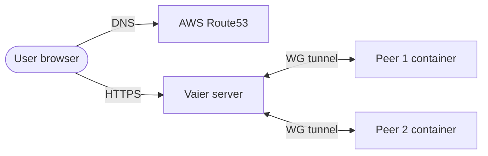

<div align="center">
  
</div>

# Vaier

[](https://github.com/getvaier/vaier/actions/workflows/build-deploy.yml)
[](https://hub.docker.com/r/getvaier/vaier)
[](LICENSE)
[](https://openjdk.org/projects/jdk/21/)

**Self-hosted infrastructure management for homelab developers.**

Vaier wires together WireGuard, Traefik, Authelia, and AWS Route53 into a single web UI. Add a Docker container on any VPN peer, pick a subdomain, and Vaier handles DNS, reverse proxy, and HTTPS — automatically.

---

## What it does

| Feature | Description |
|---------|-------------|
| **VPN peer management** | Create, delete, and monitor WireGuard peers with downloadable configs (QR code, `.conf`, docker-compose, or setup script). |
| **Service publishing** | Publish any container on a peer as a public HTTPS subdomain in one click — or share one subdomain across several services via path prefixes (`host/auth/*`, `host/api/*`, …). Automatic rollback if the flow fails. |
| **Smart launchpad** | A dashboard that links to every published service, switching to direct LAN URLs when you're on the same network. Tiles show the path segment (for path-based routes) or the subdomain, with an optional operator-supplied display name. Hide internal-only services per route, and dim those whose backend is currently unreachable. |
| **Reverse proxy** | Traefik dynamic config generated automatically, with per-service Authelia toggle and root-path redirect. |
| **DNS management** | Full CRUD for AWS Route53 zones and records. |
| **User management** | Manage Authelia users and groups from the UI. |
| **Email notifications** | SMTP-powered password resets and admin alerts when any server-type machine (VPN server peers and LAN servers) goes up or down. |
| **Consistent branding** | Authelia login pages share Vaier's dark theme so the auth hand-off feels seamless. |

---

## How it fits together



Every published service resolves via Route53 to the single Vaier server, terminates TLS at Traefik, optionally passes Authelia, and is proxied over WireGuard to the container running on a peer.

---

## Prerequisites

- A Linux server with a public IP (EC2 t3.small or similar)
- Docker and Docker Compose v2.23+ (the compose file embeds an inline `configs:` entry, which requires Compose v2.23 or newer — December 2023). The `curl get.docker.com | sh` step below installs current.
- A domain name you control
- AWS credentials with Route53 access — *or* skip them entirely and Vaier will run in manual DNS mode (you maintain records yourself)

### Server ports to open

| Port | Protocol | Purpose |
|------|----------|---------|
| 22 | TCP | SSH |
| 80 | TCP | HTTP (Let's Encrypt challenge) |
| 443 | TCP | HTTPS |
| 51820 | UDP | WireGuard VPN |

---

## Quick start

### 1. Install Docker

Run as your regular SSH user (e.g. `ubuntu` on EC2 Ubuntu AMIs, `ec2-user` on Amazon Linux) — **don't `sudo su -` to root first**. The rest of the quick start assumes an unprivileged user that's a member of the `docker` group; running as root skips that path and leaves bind-mounted config dirs root-owned, which complicates later edits.

```bash
curl -fsSL https://get.docker.com | sh
sudo usermod -aG docker $USER   # then log out and back in
```

Confirm with `docker ps` (no `sudo`) before continuing. If it errors with permission denied, the new group membership hasn't taken effect — fully close the SSH session and reconnect.

### 2. Download the compose file

```bash
mkdir -p vaier && cd vaier
curl -fsSL https://raw.githubusercontent.com/getvaier/vaier/main/docker-compose.yml -o docker-compose.yml
```

### 3. Pick a DNS mode

Vaier supports two modes — choose one based on where your domain lives. The mode is **inferred at boot from the presence of AWS credentials**: include them, you get Route53 automation; omit them, you get manual DNS. There is no separate switch.

#### Option A: Route53 (automated)

If your domain is on AWS Route53 and you want Vaier to manage DNS for you, include the AWS credentials in `.env`:

```bash
cat > .env <<'EOF'
VAIER_DOMAIN=yourdomain.com
ACME_EMAIL=you@yourdomain.com
VAIER_AWS_KEY=AKIA...
VAIER_AWS_SECRET=...
EOF
chmod 600 .env
```

The AWS credentials need Route53 permissions on the hosted zone for `yourdomain.com`. Vaier auto-creates `vaier.yourdomain.com` and `login.yourdomain.com` on first boot, and a CNAME per published service after that.

#### Option B: Manual DNS (no AWS)

If your domain isn't on Route53, or you'd rather Vaier never touched AWS, simply leave the AWS variables out:

```bash
cat > .env <<'EOF'
VAIER_DOMAIN=yourdomain.com
ACME_EMAIL=you@yourdomain.com
EOF
chmod 600 .env
```

You then maintain DNS records yourself in whatever provider you use. **Before first boot**, create these two records:

| Record | Type | Value |
|--------|------|-------|
| `vaier.yourdomain.com` | A or CNAME | the public IP/hostname of this server |
| `login.yourdomain.com` | CNAME | `vaier.yourdomain.com` |

**Each time you publish a service**, also create a `<subdomain>.yourdomain.com` CNAME pointing at `vaier.yourdomain.com`. Vaier waits up to two minutes for the record to propagate, then activates the Traefik route automatically. If the record never appears the publish is rolled back.

### 4. Start the stack

```bash
docker compose up -d
```

### 5. First login

Once `docker compose ps` shows every service as `Up`, read the one-time admin password:

```bash
cat authelia/config/.bootstrap-admin-password
```

Open `https://vaier.yourdomain.com`, log in as `admin`, change the password from *Settings → Users*, then delete the bootstrap file:

```bash
rm authelia/config/.bootstrap-admin-password
```

For optional environment variables, secret-file hardening, and other advanced topics, see [`docs/ADVANCED.md`](docs/ADVANCED.md).

---

## Adding a VPN peer

Create peers from the Vaier UI. The peer type determines WireGuard defaults and which download options are shown:

| Peer type | Typical use | Default routing | Downloads |
|-----------|-------------|-----------------|-----------|
| Mobile client | Phone/tablet internet access via VPN | All traffic | QR code, `.conf` |
| Windows client | Laptop internet access via VPN | All traffic | `.conf` |
| Ubuntu server with Docker | Self-hosted services on a Linux host | VPN subnet only | docker-compose, setup script |
| Windows server with Docker | Self-hosted services on a Windows Docker host | VPN subnet only | docker-compose |

After creating a peer, download its config and connect. Vaier shows the peer's handshake status.

---

## Publishing a service

1. Start a Docker container on any connected peer.
2. In Vaier → Services → Publishable, the container appears automatically.
3. Select it, enter a subdomain, optionally enable Authelia authentication.
4. Vaier creates the DNS CNAME, the Traefik route, and (optionally) Authelia middleware.

The service is live at `https://subdomain.yourdomain.com`.

### Multiple services on one subdomain

Set an optional **Path prefix** at publish time (e.g. `/auth`) to put more than one service behind a single subdomain. Traefik routes by `Host(...) && PathPrefix(...)`, picks the more-specific rule first, and forwards the full path unchanged to the backend:

```
bmp.yourdomain.com         →  http://rig.yourdomain.com:8080
bmp.yourdomain.com/auth/*  →  http://rig.yourdomain.com:8090/auth/*
```

(`/auth` reaches the backend intact — Vaier doesn't strip the prefix.)

The first publish on a host creates the DNS CNAME; later routes — host-only or path-prefixed — reuse it. Deleting any sibling leaves the CNAME alive; only when the last route on a host is removed does the CNAME go.

For publishing services from non-peer LAN machines (NAS, printers, extra Docker hosts), see [`docs/ADVANCED.md`](docs/ADVANCED.md).

---

## Roadmap

The backlog is tracked in [GitHub Issues](https://github.com/getvaier/vaier/issues). Feature specs for planned items are in [`PRD.md`](PRD.md).

---

## Contributing

Contributions are welcome. See [`CONTRIBUTING.md`](CONTRIBUTING.md) for the development guide (architecture, TDD rules, build instructions, PR expectations).

---

## Disclaimer

Vaier is a personal homelab tool provided as-is. Use it at your own risk. The authors accept no responsibility for security incidents, data loss, service outages, misconfigured firewalls, exposed services, or any other damage arising from its use. Running this software means exposing infrastructure to the internet — you are responsible for understanding what you are deploying.

The Apache License 2.0 (below) contains the full warranty disclaimer and limitation of liability in sections 7 and 8.

## License

Apache License 2.0 — see [LICENSE](LICENSE).

## Attribution

IP geolocation on the Machines page is provided by [DB-IP](https://db-ip.com), licensed under [CC BY 4.0](https://creativecommons.org/licenses/by/4.0/). The `geoip-init` container downloads the latest DB-IP City Lite database to a local volume on first boot and refreshes it monthly.

---

*Built for the self-hosted community.*
