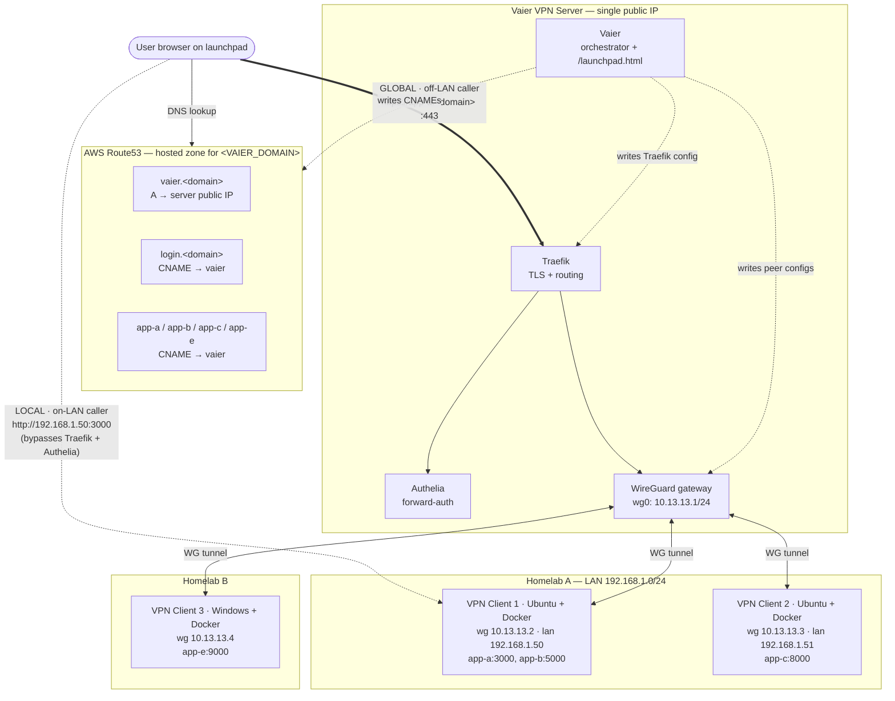

<div align="center">
  
</div>

# Vaier

[](https://github.com/getvaier/vaier/actions/workflows/build-deploy.yml)
[](https://hub.docker.com/r/getvaier/vaier)
[](LICENSE)
[](https://openjdk.org/projects/jdk/21/)

**Self-hosted infrastructure management for homelab developers.**

Vaier wires together WireGuard, Traefik, Authelia, and AWS Route53 into a single web UI. Add a Docker container on any VPN peer, pick a subdomain, and Vaier handles DNS, reverse proxy, and HTTPS — automatically.

---

<!-- Add a demo GIF here once available. Suggested flow: create a peer → publish a service → watch the live processing steps → service goes live. -->
<!--  -->

## What it does

| Feature | Description |
|---------|-------------|
| **VPN peer management** | Create and delete WireGuard peers. Download peer config as a `.conf` file, QR code (mobile), docker-compose, or a one-shot bash setup script. Server peers can record a LAN address (editable inline) so the launchpad can link directly to services on the local network. |
| **Service publishing** | Discover Docker containers on the VPN server and on connected peers. Publish any container as a public HTTPS subdomain in one action. Automatic rollback of the DNS CNAME if the publish flow fails (DNS timeout, Traefik error, or Traefik never picks up the route), and automatic cleanup of published services when a peer is deleted. |
| **Smart launchpad** | Public `/launchpad.html` tiles link to `https://service.domain` normally, but switch to direct `http://lanAddress:port` when the caller is on the same LAN as the hosting server — bypassing the proxy and auth. Per-service opt-out for apps whose public origin differs from `http://lan:port` (e.g. Vaultwarden). |
| **Reverse proxy** | Automatically generates Traefik dynamic config. Per-service Authelia authentication toggle, editable root path redirect, and per-service direct LAN URL opt-out. |
| **DNS management** | Full CRUD for AWS Route53 zones and records. |
| **User management** | Manage Authelia users from the UI (create, delete, change password). |
| **Email notifications** | SMTP settings in *Settings* power Authelia password-reset emails today and future Vaier notifications. Credentials are verified against the server before saving; a dedicated "Send test email" button delivers a real roundtrip message to any recipient. |
| **Consistent branding** | Authelia login and 2FA pages share Vaier's dark theme and logo, so the hand-off from `vaier.<domain>` to `login.<domain>` doesn't feel like a different app. |

---

## Stack

Vaier runs as part of a five-container Docker Compose stack:

| Service | Role |
|---------|------|
| **WireGuard** (`linuxserver/wireguard`) | VPN server, UDP 51820 |
| **Traefik** | Reverse proxy + Let's Encrypt TLS |
| **Authelia** | Authentication middleware |
| **Redis** | Authelia session store |
| **Vaier** | This application (port 8888 externally) |

---

## How it fits together

Every published service resolves to the single Vaier server via Route53, terminates TLS at Traefik, optionally passes Authelia forward-auth, and is proxied over a WireGuard tunnel to the container running on a peer.

The launchpad is aware of where the request is coming from: off-LAN users hit the **global** `https://service.<domain>` URL, while users on the same LAN as the hosting peer are handed the **local** `http://lan-address:port` URL that bypasses Traefik and Authelia entirely.



---

## Prerequisites

- A Linux server with a public IP (EC2 t3.small or similar)
- Docker and Docker Compose installed
- A domain name you control
- AWS credentials with Route53 access

### Server ports to open

| Port | Protocol | Purpose |
|------|----------|---------|
| 22 | TCP | SSH |
| 80 | TCP | HTTP (Let's Encrypt challenge) |
| 443 | TCP | HTTPS |
| 51820 | UDP | WireGuard VPN |

---

## Quick start

### 1. Install Docker

On a fresh Linux server, install Docker Engine and the Compose plugin using the official convenience script:

```bash
curl -fsSL https://get.docker.com | sh
```

To run `docker` without `sudo`, add your user to the `docker` group and re-login:

```bash
sudo usermod -aG docker $USER
```

Verify the install:

```bash
docker --version
docker compose version
```

For other platforms or manual installation steps, see the [official Docker install docs](https://docs.docker.com/engine/install/).

### 2. Create a folder and download the compose file

```bash
mkdir -p vaier && cd vaier
curl -fsSL https://raw.githubusercontent.com/getvaier/vaier/main/docker-compose.yml -o docker-compose.yml
```

### 3. Create the `.env` file

```bash
cat > .env <<'EOF'
VAIER_DOMAIN=yourdomain.com
ACME_EMAIL=you@yourdomain.com
VAIER_AWS_KEY=AKIA...
VAIER_AWS_SECRET=...
EOF
chmod 600 .env
```

All four values are required. The AWS credentials need Route53 permissions on the hosted zone for `yourdomain.com`.

Vaier auto-creates the `vaier.yourdomain.com` and `login.yourdomain.com` records in Route53 on first boot. On EC2, the public hostname is detected from instance metadata. On other hosts, set `VAIER_PUBLIC_HOST` (CNAME target) or `VAIER_PUBLIC_IP` (A record target) in `.env`.

### 4. Start the stack

```bash
docker compose up -d
```

### 5. First login

Once `docker compose ps` shows every service as `Up`, read the one-time admin password Vaier wrote to disk:

```bash
cat authelia/config/.bootstrap-admin-password
```

Open `https://vaier.yourdomain.com` in your browser, log in as `admin` with that password, change it from *Settings → Users*, then delete the bootstrap file:

```bash
rm authelia/config/.bootstrap-admin-password
```

---

## Environment variables

| Variable | Required | Description |
|----------|----------|-------------|
| `VAIER_AWS_KEY` | Yes | AWS access key for Route53 |
| `VAIER_AWS_SECRET` | Yes | AWS secret key for Route53 |
| `VAIER_DOMAIN` | Yes | Base domain (e.g. `yourdomain.com`) |
| `ACME_EMAIL` | Yes | Email for Let's Encrypt notifications |
| `VAIER_PUBLIC_HOST` | No | Public hostname of this server; used as the CNAME target for `vaier.<domain>` when not on EC2 |
| `VAIER_PUBLIC_IP` | No | Public IPv4 of this server; used as an A-record target for `vaier.<domain>` when not on EC2 |
| `WIREGUARD_CONFIG_PATH` | No | WireGuard config dir (default: `/wireguard/config`) |
| `WIREGUARD_CONTAINER_NAME` | No | WireGuard container name (default: `wireguard`) |
| `TRAEFIK_CONFIG_PATH` | No | Traefik dynamic config dir (default: `/traefik/config`) |
| `TRAEFIK_API_URL` | No | Traefik API URL (default: `http://traefik:8080`) |
| `AUTHELIA_CONFIG_PATH` | No | Authelia config dir (default: `/authelia/config`) |

---

## Secrets on disk

Vaier writes new secret files at mode `600` (`rw-------`). For an upgraded deployment you should also tighten the existing files and the surrounding directories on the host:

```bash
chmod 600 .env production.env 2>/dev/null
chmod -R go-rwx vaier/ authelia/ wireguard/ traefik/
```

Files Vaier creates and protects:

| File | Contents |
|------|----------|
| `vaier/config/vaier-config.yml` | AWS Route53 credentials, SMTP settings |
| `authelia/config/secrets.properties` | Authelia JWT/session/encryption secrets, SMTP password |
| `authelia/config/users_database.yml` | Authelia users with Argon2 password hashes |
| `authelia/config/redis-password` | Auto-generated Redis password (created by the `redis-init` container) |
| `authelia/config/.bootstrap-admin-password` | One-time bootstrap admin password (delete after first login) |

The `.env` file you create yourself — keep it at mode `600`.

---

## Adding a VPN peer

Peers are created from the Vaier UI. When creating a peer, select its type — the type determines the WireGuard config defaults and which download options are shown:

| Peer type | Typical use | Default routing | Downloads |
|-----------|-------------|-----------------|-----------|
| Mobile client | Phone/tablet internet access via VPN | All traffic | QR code, `.conf` |
| Windows client | Laptop internet access via VPN | All traffic | `.conf` |
| Ubuntu server with Docker | Self-hosted services on a Linux host | VPN subnet only | docker-compose, setup script |
| Windows server with Docker | Self-hosted services on a Windows Docker host | VPN subnet only | docker-compose |

After creating a peer, download its config and connect. Vaier shows the peer's handshake status.

---

## Publishing a service

1. Start a Docker container on any connected peer
2. In Vaier → Services → Publishable, the container appears automatically
3. Select the container, enter a subdomain, optionally enable Authelia authentication
4. Vaier creates a DNS CNAME record pointing to the VPN server, a Traefik route, and (optionally) Authelia middleware

The service is live at `https://subdomain.yourdomain.com`.

---

## Roadmap

The backlog is tracked in [GitHub Issues](https://github.com/getvaier/vaier/issues). Feature specs for planned items are in [`PRD.md`](PRD.md). See [`CONTRIBUTING.md`](CONTRIBUTING.md) to get started.

---

## Development

### Build and run locally

```bash
mvn clean package -DskipTests   # build
mvn spring-boot:run              # run on :8080
```

Swagger UI: `http://localhost:8080/swagger-ui.html`

### Build the Docker image

```bash
mvn clean package -DskipTests
docker build --build-arg VAIER_VERSION=$(mvn -q help:evaluate -Dexpression=project.version -DforceStdout) \
  -t getvaier/vaier:latest .
docker compose up -d --force-recreate vaier
```

> The compose file uses `getvaier/vaier:latest`. Building as any other tag will not be picked up.

### Architecture

Hexagonal (ports & adapters) with four layers:

- **Domain** — business logic, entities, port interfaces. No Spring dependencies.
- **Application** — use case interfaces and service implementations.
- **Infrastructure** (`adapter/driven/`) — adapters for WireGuard, Traefik, Route53, Docker, Authelia.
- **Web** (`rest/`) — REST controllers; DTOs are inner `record` classes.

---

## Contributing

Contributions are welcome. The [roadmap](#roadmap) above lists what's planned — pick any item, check the full spec in [`PRD.md`](PRD.md), and open an issue before starting to avoid duplicate work.

For bugs, browse [open issues](https://github.com/getvaier/vaier/issues) or open a new one. See [`CONTRIBUTING.md`](CONTRIBUTING.md) for the development guide (architecture, TDD rules, PR expectations).

---

## Disclaimer

Vaier is a personal homelab tool provided as-is. Use it at your own risk. The authors accept no responsibility for security incidents, data loss, service outages, misconfigured firewalls, exposed services, or any other damage arising from its use. Running this software means exposing infrastructure to the internet — you are responsible for understanding what you are deploying.

The Apache License 2.0 (below) contains the full warranty disclaimer and limitation of liability in sections 7 and 8.

## License

Apache License 2.0 — see [LICENSE](LICENSE).

---

*Built for the self-hosted community.*
