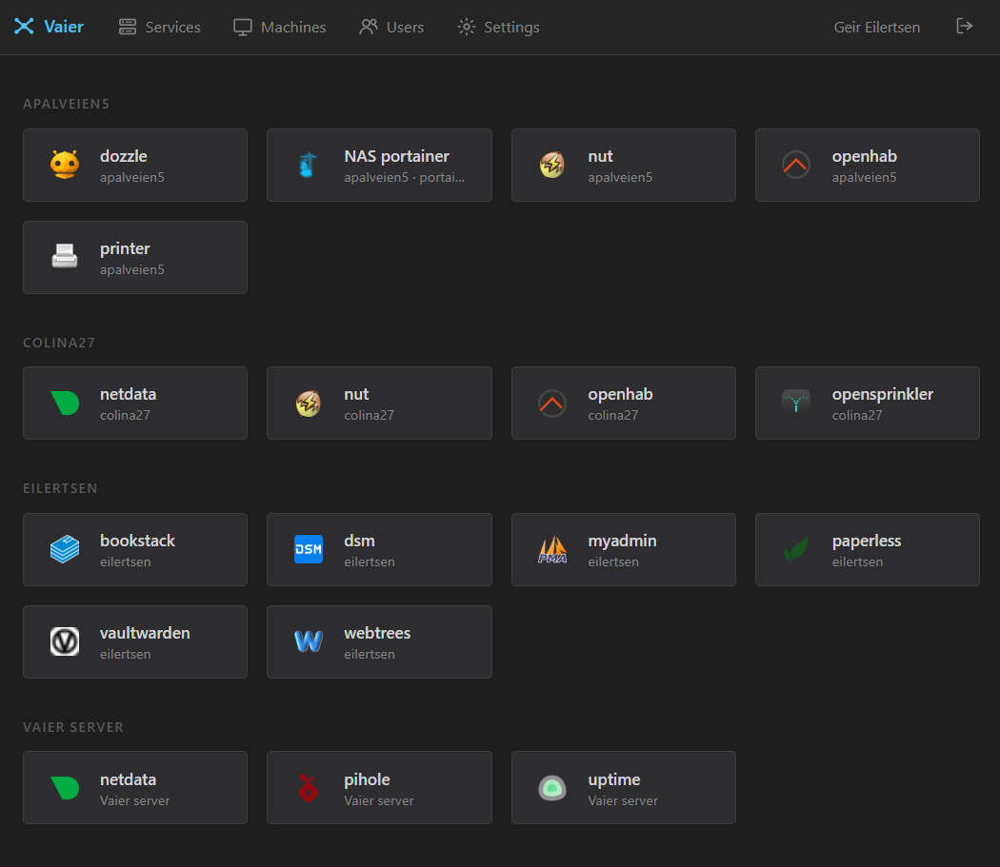

<div align="center">
  
</div>

# Vaier

[](https://github.com/getvaier/vaier/actions/workflows/build-deploy.yml)
[](https://hub.docker.com/r/getvaier/vaier)
[](LICENSE)
[](https://openjdk.org/projects/jdk/21/)

**Self-hosted infrastructure management for homelab developers.**

Vaier wires together WireGuard, Traefik, Authelia, and AWS Route53 into a single web UI. Add a Docker container on any VPN peer, pick a subdomain, and Vaier handles DNS, reverse proxy, and HTTPS — automatically.

---

## What it does

| Feature | Description |
|---------|-------------|
| **VPN peer management** | Create, delete, and monitor WireGuard peers with downloadable configs (QR code, `.conf`, docker-compose, or setup script). |
| **Service publishing** | Publish any container on a peer as a public HTTPS subdomain in one click — or share one subdomain across several services via path prefixes (`host/auth/*`, `host/api/*`, …). Automatic rollback if the flow fails. |
| **Smart launchpad** | A dashboard that links to every published service, switching to direct LAN URLs when you're on the same network. Tiles show the path segment (for path-based routes) or the subdomain, with an optional operator-supplied display name. Hover a tile to see the Docker image and version behind the service — or point a service at a version endpoint so one running natively on a LAN machine reports its version too. Hide internal-only services per route, mark tiles whose hosting machine is unreachable with a red "host offline" dot (VPN handshake age or LAN reachability probe), and hide auth-protected tiles from anonymous viewers so internal URLs don't leak. |
| **Reverse proxy** | Traefik dynamic config generated automatically, with per-service Authelia toggle and root-path redirect. When a service's backend is down, visitors get Vaier's branded **offline page** (naming the service, with retry and back-to-launchpad links) instead of Traefik's bare gateway error. A standalone page server stands in even when **Vaier itself** is down, so the control panel host shows the branded page rather than "Bad gateway". |
| **DNS management** | Full CRUD for AWS Route53 zones and records. |
| **User management** | Manage Authelia users and groups from the UI. |
| **Email notifications** | SMTP-powered password resets and admin alerts when any server-type machine (VPN server peers and LAN servers) goes up or down, or when the Vaier server's own disk fills past a configurable threshold. |
| **Host disk monitoring** | Vaier watches free space on its own host filesystem and emails all admins when usage crosses a configurable threshold (default 85%), with a recovery email once it drops back below. |
| **Device category** | Each machine carries a **device category** (phone, laptop, desktop, server, NAS, printer, router, gateway, IoT, camera, media, or generic) that decides which icon it shows — independent of its VPN role. Vaier auto-detects it from the machine's name, scan hints, and type; you can pin an explicit category to override the guess, and clear it to fall back to auto-detection. Icon-only: it never changes routing. |
| **Inline field help** | Advanced fields (LAN CIDR, path prefix, root redirect, the auth toggle, direct LAN URL, hide-from-launchpad, version endpoint) carry a small "?" you can hover for a one-line plain-language explanation — no need to read the docs to know what a field does. |
| **Concepts page** | An in-app **Concepts** glossary in the admin shell explaining, in plain language, every term you meet in the UI — grouped by area, each with a short definition and a one-line "why it matters". Each entry is deep-linkable via its anchor (e.g. `concepts.html#lan-cidr`). |
| **Consistent branding** | Authelia login pages share Vaier's dark theme so the auth hand-off feels seamless. |
| **LAN scanner** _(Enterprise)_ | When adding a **LAN server**, scan its relay's LAN right from the Add Machine dialog to discover hosts and pick one to fill in the address. Already-registered machines are filtered out, so only new hosts appear. Requires an Enterprise licence. |
| **Version visibility** | The running Vaier version and edition (Community/Enterprise) are shown under *Settings → About*, so you always know which build is deployed. |

> **Editions** — Vaier ships as a single binary. **Community** (the default) is free and fully featured for everything above the line. **Enterprise** unlocks paid add-ons (starting with the **LAN scanner**) when you install a licence — see [Enterprise licence](#enterprise-licence).



---

## How it fits together


Every published service resolves via Route53 to the single Vaier server, terminates TLS at Traefik, optionally passes Authelia, and is proxied over WireGuard to the container running on a peer.

---

## Prerequisites

- A Linux server with a public IP (EC2 t3.small or similar)
- Docker and Docker Compose v2.23+ (the compose file embeds an inline `configs:` entry, which requires Compose v2.23 or newer — December 2023). The `curl get.docker.com | sh` step below installs current.
- A domain name you control
- AWS credentials with Route53 access — *or* skip them entirely and Vaier will run in manual DNS mode (you maintain records yourself)

### Server ports to open

| Port | Protocol | Purpose |
|------|----------|---------|
| 22 | TCP | SSH |
| 80 | TCP | HTTP (Let's Encrypt challenge) |
| 443 | TCP | HTTPS |
| 51820 | UDP | WireGuard VPN |

---

## Quick start

### 1. Install Docker

Run as your regular SSH user (e.g. `ubuntu` on EC2 Ubuntu AMIs, `ec2-user` on Amazon Linux) — **don't `sudo su -` to root first**. The rest of the quick start assumes an unprivileged user that's a member of the `docker` group; running as root skips that path and leaves bind-mounted config dirs root-owned, which complicates later edits.

```bash
curl -fsSL https://get.docker.com | sh
sudo usermod -aG docker $USER   # then log out and back in
```

Confirm with `docker ps` (no `sudo`) before continuing. If it errors with permission denied, the new group membership hasn't taken effect — fully close the SSH session and reconnect.

### 2. Download the compose file

```bash
mkdir -p vaier && cd vaier
curl -fsSL https://raw.githubusercontent.com/getvaier/vaier/main/docker-compose.yml -o docker-compose.yml
```

### 3. Pick a DNS mode

Vaier supports two modes — choose one based on where your domain lives. The mode is **inferred at boot from the presence of AWS credentials**: include them, you get Route53 automation; omit them, you get manual DNS. There is no separate switch.

#### Option A: Route53 (automated)

If your domain is on AWS Route53 and you want Vaier to manage DNS for you, include the AWS credentials in `.env`:

```bash
cat > .env <<'EOF'
VAIER_DOMAIN=yourdomain.com
ACME_EMAIL=you@yourdomain.com
VAIER_AWS_KEY=AKIA...
VAIER_AWS_SECRET=...
EOF
chmod 600 .env
```

The AWS credentials need Route53 permissions on the hosted zone for `yourdomain.com`. Vaier auto-creates `vaier.yourdomain.com` and `login.yourdomain.com` on first boot, and a CNAME per published service after that.

#### Option B: Manual DNS (no AWS)

If your domain isn't on Route53, or you'd rather Vaier never touched AWS, simply leave the AWS variables out:

```bash
cat > .env <<'EOF'
VAIER_DOMAIN=yourdomain.com
ACME_EMAIL=you@yourdomain.com
EOF
chmod 600 .env
```

You then maintain DNS records yourself in whatever provider you use. **Before first boot**, create these two records:

| Record | Type | Value |
|--------|------|-------|
| `vaier.yourdomain.com` | A or CNAME | the public IP/hostname of this server |
| `login.yourdomain.com` | CNAME | `vaier.yourdomain.com` |

**Each time you publish a service**, also create a `<subdomain>.yourdomain.com` CNAME pointing at `vaier.yourdomain.com`. Vaier waits up to two minutes for the record to propagate, then activates the Traefik route automatically. If the record never appears the publish is rolled back.

### 4. Start the stack

```bash
docker compose up -d
```

### 5. First login

Once `docker compose ps` shows every service as `Up`, read the one-time admin password:

```bash
cat authelia/config/.bootstrap-admin-password
```

Open `https://vaier.yourdomain.com`, log in as `admin`, change the password from *Settings → Users*, then delete the bootstrap file:

```bash
rm authelia/config/.bootstrap-admin-password
```

For optional environment variables, secret-file hardening, and other advanced topics, see [`docs/ADVANCED.md`](docs/ADVANCED.md).

---

## Adding a VPN peer

Create peers from the Vaier UI. The peer type determines WireGuard defaults and which download options are shown:

| Peer type | Typical use | Default routing | Downloads |
|-----------|-------------|-----------------|-----------|
| Mobile client | Phone/tablet internet access via VPN | All traffic | QR code, `.conf` |
| Windows client | Laptop internet access via VPN | All traffic | `.conf` |
| Ubuntu server with Docker | Self-hosted services on a Linux host | VPN subnet only | docker-compose, setup script |
| Windows server with Docker | Self-hosted services on a Windows Docker host | VPN subnet only | docker-compose |

Each machine — VPN peer or LAN server — can carry an optional **description**, a free-text note (e.g. "Home media server (NUC, Ubuntu 22.04)") set on the Add Machine form and editable inline on the expanded card. It shows as a muted subtitle under the machine name so its purpose is obvious at a glance.

Peers and LAN servers can be **renamed** in place — expand the card and edit the **Name** field. A peer's **name** is just a display label: editing it leaves the peer's underlying id (its config directory, REST paths, and routing) untouched, so the live tunnel and any published services keep working. The id is the slug Vaier derives from the name you first typed; the name is then yours to change freely. Names must be **unique across every machine** — Vaier won't let you add or rename a peer or LAN server onto a name another machine already uses (matched case-insensitively, surrounding spaces ignored), so you never end up with two cards wearing the same label. Clearing a peer's name reverts it to the humanised id — allowed as long as that fallback label isn't already used by another machine.

**LAN servers** (a NAS, printer, IPMI host, or an extra Docker host on a peer's LAN or in the Vaier server's own subnet) are added from **Add Machine** — Vaier only needs the host's LAN address. After adding, the machine's card offers a single **Setup script** to run on that host. The script adapts to what the host needs: it opens the Docker engine API (if you marked it as running Docker — native and snap installs covered) and installs persistent routes to the Vaier server's subnet (and other sites' LANs) via the host's relay peer, so a machine behind one relay can reach the rest of your Vaier network. It's idempotent and safe to re-run.

Each machine also has a **device category** — phone, laptop, desktop, server, NAS, printer, router, gateway, IoT, camera, media, or generic — that decides which icon it shows. Vaier auto-detects it from the machine's name (e.g. "synology-nas" → NAS), any LAN-scan hint, and its peer type, falling back to a generic icon. You can pin an explicit category to override the guess; clearing the override reverts to auto-detection, and renaming a machine re-detects when no override is set. The device category is presentation only — it never affects how Vaier routes or keys a machine.

Every machine card carries a **status colour** on its type icon — green (reachable / connected), amber (reachable but the Docker scrape failed), red (unreachable), or grey (not yet probed). Hovering a machine's icon shows the state in plain language with the evidence behind it (e.g. "Green — connected, last handshake 12s ago").

The Machines page offers three views via a tab switcher: a **List** of machine cards, a **Map** plotting each machine at its geographic location on a world map, and a **Topology** diagram — an interactive, force-directed bird's-eye view of the whole Vaier network. In the Topology view the Vaier server, every VPN peer, each LAN server, and every published service are nodes in a live physics simulation: the graph lays itself out automatically, and you can drag a node (its neighbours follow), zoom, and pan. **Published services** attach to the machine that hosts them (a VPN peer, a LAN server, or the central Vaier hub for server-side services), each coloured green/red/grey by its own health, with its authentication state in the tooltip. Edges are coloured and dashed by connectivity status (green for connected, red for down, yellow for degraded, grey for unknown), reusing the same machine icons and status colours as the other tabs, and the whole diagram updates live as machines and services come and go.

On the **List** tab, expanding a machine card reveals a **Services** section that fuses what's published with what could be: the reverse-proxy routes hosted on that machine appear first — each expandable to edit its authentication, display name, and advanced options inline, or to delete it — followed by the host's discovered-but-unpublished containers as **+ Publish** rows that open the publish flow pre-filled. This makes each machine card the single place to see and manage everything running on a host, without leaving the page.

After creating a peer, download its config and connect. Vaier shows the peer's handshake status.

### Show-once peer config

The WireGuard config for a peer is delivered **exactly once**, at create time: the create-success modal shows the config text, an inline QR code, and download buttons for `.conf` / `docker-compose.yml` / setup script as appropriate. Save what you need before closing the modal — the five secret-bearing endpoints (`/config`, `/config-file`, `/qr-code`, `/docker-compose`, `/setup-script`) return `410 Gone` once the budget is burned.

To get a fresh config for an existing peer, the peer's row offers two actions:

- **Reissue config** — re-renders the config from the *current* generation logic while **keeping the peer's keypair**, then re-opens the one-shot delivery. Use this to **recover a lost config** without disrupting the tunnel — the keys are preserved, though the re-rendered contents may differ from the original (e.g. updated `AllowedIPs`) — or to refresh one that's gone **out of date** because what Vaier would generate now no longer matches the installed config (the peer's row shows a ⚠ **out-of-date config** badge). The live tunnel keeps working; reinstall the reissued config on the peer machine to apply it.
- **Regenerate** — deletes and recreates the peer with the same name, **rotating the keypair** as a side effect. Use this if the key may be compromised; the old config stops working immediately.

Why show-once: WireGuard has no session concept, no server-side revocation, and the same config works on any number of devices. A leaked screenshot or `.conf` would otherwise be a permanent backdoor.

---

## Publishing a service

1. Start a Docker container on any connected peer.
2. In Vaier → Services → Publishable, the container appears automatically.
3. Select it, enter a subdomain, optionally enable Authelia authentication.
4. Vaier creates the DNS CNAME, the Traefik route, and (optionally) Authelia middleware.

The service is live at `https://subdomain.yourdomain.com`.

### Multiple services on one subdomain

Set an optional **Path prefix** at publish time (e.g. `/auth`) to put more than one service behind a single subdomain. Traefik routes by `Host(...) && PathPrefix(...)`, picks the more-specific rule first, and forwards the full path unchanged to the backend:

```
bmp.yourdomain.com         →  http://rig.yourdomain.com:8080
bmp.yourdomain.com/auth/*  →  http://rig.yourdomain.com:8090/auth/*
```

(`/auth` reaches the backend intact — Vaier doesn't strip the prefix.)

The first publish on a host creates the DNS CNAME; later routes — host-only or path-prefixed — reuse it. Deleting any sibling leaves the CNAME alive; only when the last route on a host is removed does the CNAME go.

For publishing services from non-peer LAN machines (NAS, printers, extra Docker hosts), see [`docs/ADVANCED.md`](docs/ADVANCED.md).

---

## Host disk monitoring

Vaier polls the free space on its own host filesystem once a minute and emails every admin user when the disk fills past a threshold — useful for catching a runaway log or image cache before it takes the server down. A **recovery** email follows once usage drops back below the threshold, and Vaier only emails on a boundary crossing (not on every poll), so a disk hovering just over the line won't spam you.

This reuses the same SMTP configuration as the up/down machine alerts (Settings → *Email notifications*), so it needs no extra mail setup. With SMTP unconfigured, monitoring is silent.

**Threshold** — the alert fires when usage rises above the configured percentage (default **85%**). Adjust it in Settings; valid range is 1–99.

**Requirements** — Vaier reads the host root filesystem through a read-only bind mount. The bundled `docker-compose.yml` already wires this up on the `vaier` service:

```yaml
    environment:
      VAIER_HOST_ROOT_PATH: /host   # where the host root is mounted inside the container
    volumes:
      - /:/host:ro                  # host root, read-only
```

If you run Vaier without that mount, disk monitoring is inert (it has nothing to read) but the rest of Vaier is unaffected.

---

## Enterprise licence

Vaier is open-core: one binary, two editions. **Community** is the default and needs no licence. **Enterprise** unlocks paid features (currently the **LAN scanner**) once you install a licence token.

A licence is an offline, cryptographically signed token — Vaier verifies it locally against a key built into the binary, so there's **no phone-home and no licence server**. To install one, set it in your `.env`:

```ini
VAIER_LICENSE=eyJ...token...
```

Restart Vaier and the Enterprise features appear; `GET /license` reports the active edition, who it's issued to, and when it expires. Without a valid licence, Enterprise endpoints return `402 Payment Required` and their UI stays hidden — Community is otherwise unaffected. An expired licence simply reverts the instance to Community.

> Licence tokens are minted by the Vaier maintainers with a private key that never ships. To obtain one, [open an issue](https://github.com/getvaier/vaier/issues) or contact the maintainers.

---

## Roadmap

The backlog is tracked in [GitHub Issues](https://github.com/getvaier/vaier/issues). Feature specs for planned items are in [`PRD.md`](PRD.md).

---

## Contributing

Contributions are welcome. See [`CONTRIBUTING.md`](CONTRIBUTING.md) for the development guide (architecture, TDD rules, build instructions, PR expectations).

---

## Disclaimer

Vaier is a personal homelab tool provided as-is. Use it at your own risk. The authors accept no responsibility for security incidents, data loss, service outages, misconfigured firewalls, exposed services, or any other damage arising from its use. Running this software means exposing infrastructure to the internet — you are responsible for understanding what you are deploying.

The Apache License 2.0 (below) contains the full warranty disclaimer and limitation of liability in sections 7 and 8.

## License

Apache License 2.0 — see [LICENSE](LICENSE).

## Attribution

IP geolocation on the Machines page is provided by [DB-IP](https://db-ip.com), licensed under [CC BY 4.0](https://creativecommons.org/licenses/by/4.0/). The `geoip-init` container downloads the latest DB-IP City Lite database to a local volume on first boot and refreshes it monthly.

---

*Built for the self-hosted community.*
