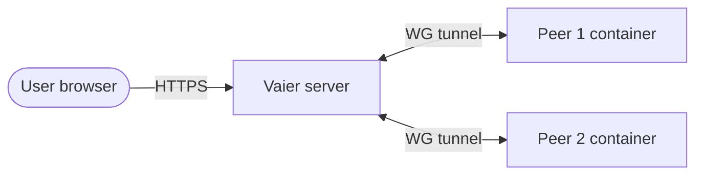

<div align="center">
  
</div>

# Vaier

[](https://github.com/getvaier/vaier/actions/workflows/build-deploy.yml)
[](https://hub.docker.com/r/getvaier/vaier)
[](LICENSE)
[](https://openjdk.org/projects/jdk/21/)

**Vaier** — Norwegian for *wire* (as in cable), pronounced **VY-er** — is the glue for your homelab.

One box on the internet. Your machines at home, behind WireGuard. Every service gets an HTTPS address, a login, and a dashboard tile — nothing to configure by hand: no Traefik files, no WireGuard configs, no DNS record beyond the one wildcard you make on day one.

---

## What it does

| Feature | Description |
|---------|-------------|
| **VPN mesh** | WireGuard peers and LAN servers (NAS, printers, extra Docker hosts) join one mesh, with cross-site routing between your networks. You're never asked for a CIDR: Vaier reads the network a machine sits on — over the SSH connection it already has — and asks only whether the fleet should reach it, naming the machine and the interface it read it from. See [`docs/NETWORKING.md`](docs/NETWORKING.md). |
| **Reverse proxy & edge hardening** | Traefik terminates HTTPS with Let's Encrypt, enforces a security-header and TLS floor on every route, blocks malicious traffic at the edge with a CrowdSec Security Engine and bouncer — every blocked address listed in the Explorer with where it came from, one click to let it back in or trust it, and everything you have trusted listed beside it, one click to untrust — and shows a branded offline page when a backend is down. The other direction is on the map too: every place someone has been *let in* from, one green dot per city, with the count and the people allowed from there, kept for a month. Accesses from your own LAN or VPN have no place on a map and are shown as a plain count beside it rather than quietly dropped — and so is a request from a full-tunnel device, which comes back to Vaier wearing the server's own address and would otherwise draw a dot wherever the server happens to be hosted. See [`docs/NETWORKING.md`](docs/NETWORKING.md). |
| **Enrolment from the Vaier app** | A phone running the Vaier app joins without meeting the WireGuard app at all. It makes its own key on the phone and asks to join, showing a four-digit code on screen while it waits — you add it from wherever you're already signed in, your own laptop or the phone itself, and the moment you do, the phone connects on its own. The private half of the key never leaves the phone — Vaier only ever sees the public half — so there is no config to save, no QR to photograph, and nothing to download for that phone ever again. Leaving is just as self-contained: the phone removes itself from the fleet for good, not just from that handset. **Get the app from your own Vaier**: open the launchpad on the phone and an **Install card** offers it — no store and no account — and the card appears only on an Android phone, and only when your Vaier is actually carrying a copy. The copy you download has your Vaier's own address written into it, so the app already knows where it came from and never asks you to type one. A phone you remove from the fleet notices on its own, too: it goes quiet, checks in over ordinary internet a few minutes later, and if it's no longer wanted it forgets itself, tells whoever's holding it, and offers to join again — you never have to touch the handset yourself. And you don't have to be watching the fleet page to catch a phone asking to join: you get a mail with its code and the one link that lets it in. *(Presence from the app and key rotation are still to come.)* |
| **Wildcard DNS** | One `*.yourdomain.com` record, made once, covers the console, sign-in, and every service you ever publish. See [`docs/NETWORKING.md`](docs/NETWORKING.md). |
| **Service publishing & launchpad** | Publish any container's web interface in one click; a viewer-adaptive dashboard links to whatever each visitor is allowed to reach, with the machine you are sitting beside listed first. A port that isn't a website — MQTT, a database — is published as a **stream**: the same name and the same HTTPS port, TLS terminated by Traefik and the bytes passed straight through. See [`docs/NETWORKING.md`](docs/NETWORKING.md). |
| **Access management** | Google or GitHub sign-in via oauth2-proxy and Dex, with roles (pending → user → admin) and per-service access groups. See [`docs/AUTH.md`](docs/AUTH.md). |
| **Fleet backup & survival kit** | Automated borg backups to one designated backup server, plus a self-updating "survival kit" so your backups stay readable even if Vaier itself is gone. A run that came back missing files says so on the machine — naming the files it lost — and one click makes Vaier read everything there from the next run. See [`docs/BACKUP.md`](docs/BACKUP.md). |
| **Monitoring & alerts** | Disk-usage watching with a fill-rate forecast that learns each disk's trend over about a week and mails you, in GiB/day, roughly a week before a disk crosses the threshold you set — counting down to that line rather than to 100%, so the warning arrives while there's still room to act instead of when the disk is already 94% full. It follows free space rather than a rounded percentage, so a disk creeping up a point a day can't hide, and a nightly build-and-prune sawtooth doesn't fake a disaster. A disk already too full when Vaier starts is mailed about immediately, then again only when it gets five points worse, never on a timer — and the all-clear waits until it has drained five points *below* the threshold, so the same build-and-prune sawtooth that can't fake a disaster can't mail you an alert and a recovery every day either. You don't have to wait for the mail: every machine's card in the Explorer carries its worst disk — the disk's own violet while it has room, amber or red once it hasn't — from the reading Vaier already takes on its rounds, so nothing is asked of a sleeping machine to draw it. A machine Vaier hasn't read yet is left blank rather than painted healthy. Plus image-update detection for **your** containers — Vaier's own stack is deliberately never marked, since it moves with a Vaier release and Settings speaks for that, and a tag that has been serving a new image every day or so (a `latest` that's really a nightly channel) is marked in the Explorer and labelled `moving`, but never mailed about, since a tag that moves on its own isn't news — with an **Update** button on any of your own containers once a newer image is available, pulling and recreating it from its own compose file over SSH and then removing the image it replaced, so a machine updated all year doesn't quietly fill its disk with versions nothing runs any more, and a plain reason instead when Vaier won't (started outside compose, or part of Vaier's own stack, which updates with Vaier itself) — and email that stays quiet — routine bans at the edge are listed in the Explorer, never mailed; only a credential attack, or CrowdSec blocking one of your own networks, reaches your inbox. See [`docs/MONITORING.md`](docs/MONITORING.md). |
| **Explorer** | One address space for the whole fleet — browse files, containers and services, select and transfer across machines, upload files into a folder by dropping them on it (a name already taken is never silently replaced — Vaier asks first), step back in time through backup archives, and see live who's blocked at the edge and which addresses you've trusted. Every place you stand on has its own link: reload, Back, Forward, a bookmark or a pasted URL all land back on the same folder, machine and archive. The fleet's own page cards every machine with what it's saying — what it can do, how its last backup went, which of its disks is closest to full, where it stands on Claude sign-in, how many containers want a newer image — and the pane takes the whole width on every screen: the cards, the crumbs and ⌘K (which searches by machine name) do the moving, with no tree column to keep in step. Each machine also says what it last opened — the service and when — known only when it reached it over the tunnel, since only there does the address belong to a device rather than a person. The fleet's **Map** plots each machine honestly: a phone or laptop's own reported position (once you've claimed the browser running on it — one tap, from that device) always beats a coarse estimate of its tunnel IP's carrier, even a fresher one, and a disconnected device with nothing reported draws no marker at all rather than a stale guess. Open a machine's marker and the Map also draws its **position trail** — where that device has actually been over the last 30 days, as a line that thins and fades toward its older end, so which way it was going reads without a legend. Only the open marker's trail is drawn, one machine at a time, so a fleet of phones doesn't turn the map into a scribble. A trail is built from reported positions alone, never from an ISP estimate of the tunnel IP's carrier: a carrier's whole address block resolves to a single point, so a journey drawn from those would be a line from the carrier's head office to itself however far the device travelled. A report joins the trail only when it's meaningfully new — ten minutes on from the last kept point, or more than 100 m away from it — and a machine keeps at most 500 points, so a browser sharing continuously can't flood the file. Sharing a position is opt-in and per-device; **Forget** erases the position, the whole trail and the device claim together, in one action — including a report already on its way when you press it, which lands to find nothing that names the device and leaves nothing behind. Panning and zooming stick across live updates now, too — a marker moves or updates in place instead of the whole map resetting under you. Settings, Users, Security, Credentials and Concepts sit in the topbar's **Vaier** menu, grouped by what they're for — your fleet, who gets in, and Vaier itself. See [`docs/EXPLORER.md`](docs/EXPLORER.md). |
| **Web terminal** | A real, persistent SSH shell to any machine, opened in its own window and reattached automatically across reconnects and redeploys. Its top bar also says where that machine stands on Claude sign-in and opens the sign-in itself, since signing in is an act in that machine's shell as the login Vaier acts as there. If a machine's SSH host key changes, Vaier refuses to connect and offers **Clear pinned key** right where the refusal appears — in the terminal window, and wherever a file or disk read was turned away. See [`docs/EXPLORER.md`](docs/EXPLORER.md). |
| **Host credentials** | One encrypted vault holds the SSH login for every machine; the browser never sees a secret. Each machine states which user Vaier acts as on it, machines where that user is `root` are tagged in the fleet, and a delete there says so before it runs. Have no key for a machine? Vaier generates an ed25519 keypair for it — the private half never leaves the server — and shows you the one line to add to that machine's `authorized_keys`. Paste your own key instead (ed25519, ECDSA or RSA) and Vaier tells you at the form if it isn't private-key material, rather than saving a `.pub` or a PuTTY `.ppk` that then fails at every connect. See [`docs/EXPLORER.md`](docs/EXPLORER.md). |
| **Fleet credentials** | The vault's other half: a secret that has to exist *on* every machine rather than one Vaier uses to reach one — a CLI's login file, an API token. Paste it once and Vaier delivers it to the same path on every machine that runs a shell it can reach, at the mode you pick. It never reads what you gave it; it copies the bytes and checks what arrived, so a file that lands owned by the wrong user — silently unreadable, rather than loudly broken — is reported as a failed write instead of sitting there looking right. Each credential shows one strip of where it stands: in place, out of date, never delivered, or a machine that was asleep. Machines with no shell to hold it are named underneath rather than counted against you, so all-green is actually reachable. Vaier rechecks every five minutes and puts back anything missing or changed — but only for a credential you've distributed at least once, never one it decided to push on its own. **Withdraw** takes it off the fleet everywhere it can reach and stops Vaier putting it back. See [`docs/EXPLORER.md`](docs/EXPLORER.md). |
| **Ask** | A chat pane in the Explorer — ask about your fleet in plain sentences and the answer streams back, built only from Vaier's own facts: which machines are connected, who's waiting to join, published services and their liveness, backups and how the last run went, disk standings, containers wanting an update, and who's blocked at the edge. For the one thing none of those facts already answers — "are there OS updates available for Colina 27?", a log, a process list, a file's contents — Ask can also run a single read-only command on a machine over SSH, as Vaier's own login user there and without sudo: only commands that look (`ls`, `cat`, `df`, `apt list --upgradable`, `docker ps`, `journalctl`, `wg show`, and the like) are allowed, chaining and redirects are refused, and anything naming where a secret lives is refused too. Ask can also *act*, but never on its own say-so: it can propose letting a waiting phone in or refusing it, backing up a machine now, updating a container to a newer image, lifting a block, or trusting an address — each a verb the Explorer already has a button for, and none of them a restart, since Vaier has no restart button at all. Proposing one puts a one-sentence **Confirmation** card in the pane with a button that says exactly what it will do; nothing runs until you click it, and the card is gone in ten minutes either way. The conversation is Vaier's to remember, not the browser's: it's kept per operator, so it's still there next time you sign in and a follow-up like "and Colina?" still knows what you meant — **Start over** in the pane forgets it for good. A long thread doesn't grow forever either: once it passes 40 turns, the older ones are shortened into a brief summary and the pane shows "Earlier, in brief: …" ahead of the last dozen turns kept in full. Paste your own Anthropic API key under **Settings** and Ask appears in the **Vaier** menu; without one, the pane explains itself instead. Reading never carries a key, a credential or a token, and nothing changes without your click. |
| **Claude sign-in** | Sign each machine's Claude Code CLI in to your own Anthropic account from Vaier's own terminal window on that machine — you never type a command on the box yourself, and never copy a credential file anywhere. Signing in is a terminal act: it runs the CLI in one login's home, so it lives in the window that *is* that machine's shell as that login. Vaier starts the sign-in on the machine, hands you the link to approve in your own browser, takes the code Anthropic shows you back to the CLI waiting there, and then asks the machine where it stands. The credential is Anthropic's to mint and the CLI's to keep — it never passes through Vaier, nothing about it is stored, and signing out runs the CLI's own logout rather than deleting a file. A sign-in lives in one user's home, so what Vaier reads and drives is the sign-in of the user it acts as on that machine — that machine's terminal window carries a **Claude** control in its top bar saying where it stands, and opening it names that user, says whether it's signed in and as which account, so a fleet quietly split across two accounts is visible before something fails oddly. The control says it in Claude's own clay too, faded when signed out, so a machine's own shell never disagrees with its fleet card — and where a sign-in can't happen there at all, there's no control rather than one that explains an impossibility. Putting the panel away ends a sign-in still in progress rather than leaving the CLI waiting at its prompt for nobody. You don't have to open a shell to see where a machine stands, either: every machine's card in the Explorer's fleet page carries a small mark in that same clay, hollow when that machine is signed out — the colour says whose sign-in it is, the weight says whether anyone holds one, and green/amber/red stay reserved for the marks that report trouble. It's read on the same five-minute rounds that read its disks, so nothing is asked of a sleeping machine to draw it — and a sign-in or sign-out you just did lands on the card straight away, rather than leaving it wrong until the next round. A machine Vaier hasn't asked yet, one with no Claude on it, and one that didn't answer all get no mark at all rather than one that says signed out. See [`docs/EXPLORER.md`](docs/EXPLORER.md). |
| **What to do next** | Each machine's pane nudges you toward the next thing worth doing with it, with the evidence shown alongside — publish its services, back it up, host the fleet's backups, read every file when a backup came back with holes, or let the fleet reach the network it sits on. Each is one yes, and a nudge that grants Vaier more reach on a machine links to what that means. See [`docs/EXPLORER.md`](docs/EXPLORER.md). |
| **Fleet-wide polish** | Inline field help, an in-app Concepts glossary, consistent sign-in branding, and device-category icons. See [`docs/EXPLORER.md`](docs/EXPLORER.md). |


---

## How it fits together


```mermaid
flowchart LR
    browser([User browser])
    server[Vaier server]
    p1[Peer 1 container]
    p2[Peer 2 container]

    browser -->|HTTPS| server
    server <-->|WG tunnel| p1
    server <-->|WG tunnel| p2
```

Every published service resolves to the single Vaier server through your one `*.yourdomain.com` record, terminates TLS at Traefik, optionally passes social-login authorization (Google or GitHub via oauth2-proxy, then Vaier's own access check), and is proxied over WireGuard to the container running on a peer. A **stream** takes the same path as far as TLS — matched by the name in the handshake — and then forwards raw bytes; it carries no login, because nothing inside it is a web request. More in [`docs/NETWORKING.md`](docs/NETWORKING.md).

---

## Prerequisites

- A Linux server with a public IP (EC2 t3.small or similar)
- Docker and Docker Compose v2.23+ (the compose file embeds an inline `configs:` entry, which requires Compose v2.23 or newer — December 2023). The `curl get.docker.com | sh` step below installs current.
- A domain name you control, hosted anywhere that can serve a wildcard `A` record

### Server ports to open

| Port | Protocol | Purpose |
|------|----------|---------|
| 22 | TCP | SSH |
| 80 | TCP | HTTP (Let's Encrypt challenge) |
| 443 | TCP | HTTPS |
| 51820 | UDP | WireGuard VPN |

---

## Quick start

### 1. Install Docker and rig the machine

```bash
curl -fsSL https://get.docker.com | sh
sudo usermod -aG docker $USER   # then log out and back in
```

Confirm with `docker ps` (no `sudo`). Then fetch the runtime files Vaier needs (the compose file, and the assets it bind-mounts) and scaffold a `.env` — **no git clone**:

```bash
mkdir -p vaier && cd vaier
curl -fsSL https://raw.githubusercontent.com/getvaier/vaier/main/install.sh | bash
```

### 2. Point your domain at it

Make one DNS record, before first boot, at whatever DNS host your domain lives on:

| Record | Type | Value |
|--------|------|-------|
| `*.yourdomain.com` | A | the public IP of this server |

That single wildcard covers the console, the sign-in hosts, and every service you publish from now on — nothing to add, ever, when you publish a service. Vaier checks it for you at every boot and reports the verdict in the boot log and in **Settings**. Caveats and the full mechanics are in [`docs/NETWORKING.md`](docs/NETWORKING.md).

### 3. Configure `.env`

Step 1 already created `.env` with three secrets generated for you. Open it and fill in your own values — **don't recreate the file**, or you'll wipe those secrets:

```ini
VAIER_DOMAIN=yourdomain.com
ACME_EMAIL=you@yourdomain.com
VAIER_OIDC_GOOGLE_CLIENT_ID=...apps.googleusercontent.com
VAIER_OIDC_GOOGLE_CLIENT_SECRET=...
VAIER_ADMIN_EMAIL=you@gmail.com
```

At least one sign-in provider — Google and/or GitHub — is required; the full registration walkthrough (OAuth client setup, redirect URIs, GitHub as an alternative or an addition) is in [`docs/AUTH.md`](docs/AUTH.md). `VAIER_ADMIN_EMAIL` becomes the first admin on first login.

### 4. Start the stack and sign in

```bash
docker compose up -d
```

Once `docker compose ps` shows every service `Up`, open `https://vaier.yourdomain.com` and sign in with your admin account. Anyone else who signs in lands as **pending** until you approve them on the **Users** page.

From here: add your machines and publish their services from the **Explorer** — see [`docs/NETWORKING.md`](docs/NETWORKING.md). Want to ask Vaier about your fleet instead of clicking through it? Paste your own Anthropic API key under **Settings** and the **Ask** pane appears in the **Vaier** menu. For optional environment variables, secret-file hardening, and other advanced topics, see [`docs/ADVANCED.md`](docs/ADVANCED.md).

---

## Updating an existing install

Re-run the same installer in your install directory, then bring the stack up:

```bash
cd vaier
curl -fsSL https://raw.githubusercontent.com/getvaier/vaier/main/install.sh | bash
docker compose up -d
```

It is safe to re-run: it refreshes the compose file and the assets the stack bind-mounts, leaves your `.env` untouched, and adds any secret a newer release generates but your `.env` predates. Steps 2 and 3 above are already done — there's no DNS record to add and nothing to edit.

That last part is the one that bites. If `docker compose up -d` stops with something like

```
required variable VAIER_CROWDSEC_BOUNCER_KEY is missing a value:
not in .env — re-run install.sh to generate it
```

your `.env` was written before that secret existed. Re-run the installer as above and start again. Compose refuses at config-parse time, before it touches a single container, so a stack that is already running keeps running — and the failure names the variable rather than letting it interpolate to an empty string and bringing the edge up broken.

---

## Roadmap

The backlog is tracked in [GitHub Issues](https://github.com/getvaier/vaier/issues). Feature specs for planned items are in [`PRD.md`](PRD.md).

---

## Contributing

Contributions are welcome. See [`CONTRIBUTING.md`](CONTRIBUTING.md) for the development guide (architecture, TDD rules, build instructions, PR expectations).

---

## Disclaimer

Vaier is a personal homelab tool provided as-is. Use it at your own risk. The authors accept no responsibility for security incidents, data loss, service outages, misconfigured firewalls, exposed services, or any other damage arising from its use. Running this software means exposing infrastructure to the internet — you are responsible for understanding what you are deploying.

The Apache License 2.0 (below) contains the full warranty disclaimer and limitation of liability in sections 7 and 8.

## License

Apache License 2.0 — see [LICENSE](LICENSE).

## Attribution

IP geolocation on the Explorer's map is provided by [DB-IP](https://db-ip.com), licensed under [CC BY 4.0](https://creativecommons.org/licenses/by/4.0/). The `geoip-init` container downloads the latest DB-IP City Lite database to a local volume on first boot and refreshes it monthly.

---

*Built for the self-hosted community.*
