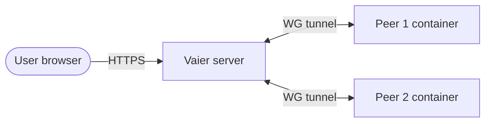

<div align="center">
  
</div>

# Vaier

[](https://github.com/getvaier/vaier/actions/workflows/build-deploy.yml)
[](https://hub.docker.com/r/getvaier/vaier)
[](LICENSE)
[](https://openjdk.org/projects/jdk/21/)

**Vaier** — Norwegian for *wire* (as in cable), pronounced **VY-er** — is the glue for your homelab.

One box on the internet. Your machines at home, behind WireGuard. Every service gets an HTTPS address, a login, and a dashboard tile — nothing to configure by hand: no Traefik files, no WireGuard configs, no DNS record beyond the one wildcard you make on day one.

---

## What it does

Each row is the short version. The linked page carries the mechanism, the caveats and the reasons.

| Feature | In short |
|---------|----------|
| **VPN mesh** | WireGuard peers and LAN servers (NAS, printers, extra Docker hosts) join one mesh, with cross-site routing between your networks and no CIDR to type. Personal devices resolve names through the Pi-hole Vaier ships with. → [Networking](docs/NETWORKING.md) |
| **Wildcard DNS** | One `*.yourdomain.com` record, made once, covers the console, sign-in, and every service you ever publish. Vaier checks it at every boot. → [Networking](docs/NETWORKING.md#wildcard-dns) |
| **Reverse proxy & edge hardening** | Traefik terminates HTTPS with Let's Encrypt, enforces a security-header and TLS floor on every route, and shows a branded offline page when a backend is down. CrowdSec blocks malicious traffic at the edge; the Explorer says each block in plain words, and you can lift one (even your own), trust the address, or block one yourself. → [Networking](docs/NETWORKING.md#edge-hardening) |
| **Service publishing & launchpad** | Publish any container's web interface in one click. A port that isn't a website — MQTT, a database — is published as a **stream** on the same HTTPS port. The launchpad shows each visitor only what they may reach. → [Networking](docs/NETWORKING.md#publishing-a-service) |
| **Access management** | Day one needs no OAuth app: the first-run password in Vaier's log makes the first sign-in the admin. Add Google or GitHub from Settings, with roles and per-service access groups. Vaier can hand a gated service its own login, and flags any service left open to anyone. → [Auth](docs/AUTH.md) |
| **The Vaier app** | The only way an Android phone or a Windows computer joins: it makes its own key, shows a four-digit join code, and connects the moment you let it in from any browser you're signed in on. The fleet sees it connect and disconnect at once. → [Networking](docs/NETWORKING.md#enrolment-from-the-vaier-app) |
| **Explorer** | One address space for the whole fleet: files, containers, services, disks and backup archives, with transfer across machines and a link for every place you stand. Each machine says where it stands and installs its OS updates on your yes. An in-app glossary explains every term. → [Explorer](docs/EXPLORER.md) |
| **Map** | Every machine plotted honestly: a device's own reported position beats an ISP estimate, a disconnected device with nothing reported draws no marker, and an open marker shows where that device has been over the last 30 days. → [Explorer](docs/EXPLORER.md#map) |
| **Topology** | The fleet as one picture: the internet is the open sea, the Vaier server a lighthouse, each LAN a village on a northern or southern coast, every tunnel a wake to the light, and every blocked address a pirate ship turned away. → [Explorer](docs/EXPLORER.md#topology) |
| **Web terminal** | A real, persistent SSH shell to any machine, in its own window, reattached across reconnects and redeploys. → [Explorer](docs/EXPLORER.md#web-terminal) |
| **Host & fleet credentials** | One encrypted vault holds the SSH login for every machine; the browser never sees a secret. A **fleet credential** is the other direction: one secret Vaier places on every machine, verifies, and puts back when it goes missing. → [Explorer](docs/EXPLORER.md#host-credentials) |
| **Claude sign-in** | Sign each machine's Claude Code CLI in to your own Anthropic account from that machine's terminal window. The credential is Anthropic's to mint and the CLI's to keep — it never passes through Vaier. → [Explorer](docs/EXPLORER.md#claude-sign-in) |
| **Fleet backup & survival kit** | Tick what matters in a machine's files and press **Back up**; Vaier does the rest, nightly, to the one machine you named as the backup server. A self-updating survival kit keeps the archives readable even if Vaier itself is gone. → [Backup](docs/BACKUP.md) |
| **Monitoring & alerts** | Disk watching with a fill-rate forecast that mails you about a week before a disk fills, a word when a container that was running stops, turns unhealthy or starts restart-looping, image-update detection with a one-click **Update**, and an inbox that stays quiet unless something is wrong. → [Monitoring](docs/MONITORING.md) |
| **Is it working?** | Vaier checks its own basics — the wildcard record, the certificate on its front door, the tunnel, the reverse proxy config — and says only what is wrong, with what to do, under **Needs you**. A healthy server shows nothing. → [Monitoring](docs/MONITORING.md#pre-flight) |
| **Chat** | Ask about your fleet in plain sentences and Marvin answers — from Vaier's own facts, a read-only command, a published service's own API, or a public web page. He acts only on your yes, hands you files, and runs errands that mail you what he found. → [Chat](docs/CHAT.md) |
| **Needs you** | The top of the fleet says what wants you — a machine not answering, a failed backup, a filling disk, someone waiting to join, then what to do next — one sentence, its evidence and one button each, and nothing at all when all is well. → [Explorer](docs/EXPLORER.md#needs-you) |


---

## How it fits together


```mermaid
flowchart LR
    browser([User browser])
    server[Vaier server]
    p1[Peer 1 container]
    p2[Peer 2 container]

    browser -->|HTTPS| server
    server <-->|WG tunnel| p1
    server <-->|WG tunnel| p2
```

Every published service resolves to the single Vaier server through your one `*.yourdomain.com` record, terminates TLS at Traefik, optionally passes social-login authorization (Google or GitHub via oauth2-proxy, then Vaier's own access check), and is proxied over WireGuard to the container running on a peer. A **stream** takes the same path as far as TLS — matched by the name in the handshake — and then forwards raw bytes; it carries no login, because nothing inside it is a web request. More in [`docs/NETWORKING.md`](docs/NETWORKING.md).

---

## Prerequisites

- A Linux server with a public IP (EC2 t3.small or similar)
- Docker and Docker Compose v2.23+ (the compose file embeds an inline `configs:` entry, which requires Compose v2.23 or newer — December 2023). The installer offers to install current Docker if it is missing.
- A domain name you control, hosted anywhere that can serve a wildcard `A` record

### Server ports to open

| Port | Protocol | Purpose |
|------|----------|---------|
| 22 | TCP | SSH |
| 80 | TCP | HTTP (Let's Encrypt challenge) |
| 443 | TCP | HTTPS |
| 51820 | UDP | WireGuard VPN |

---

## Quick start

### 1. Run the installer

On the server, in the folder Vaier should live in — **no git clone**:

```bash
mkdir -p vaier && cd vaier
curl -fsSL https://raw.githubusercontent.com/getvaier/vaier/main/install.sh | bash
```

It asks three things — your domain, your email and your time zone — and offers to install Docker if it is missing. Sign-in providers and mail are set later, in the console's **Settings**. More in [`docs/ADVANCED.md`](docs/ADVANCED.md#the-installer).

### 2. Point your domain at it

The installer checks whether `vaier.yourdomain.com` already reaches this server. If not, it prints the one record to make, with this server's public IP filled in:

| Record | Type | Value |
|--------|------|-------|
| `*.yourdomain.com` | A | the public IP of this server |

That single wildcard covers the console, the sign-in hosts, and every service you publish from now on. You can start Vaier before it resolves: Vaier waits for it before asking Let's Encrypt. Caveats are in [`docs/NETWORKING.md`](docs/NETWORKING.md#wildcard-dns).

### 3. Start Vaier and sign in

Say yes when the installer offers to start Vaier. It waits for the boot and prints your **first-run sign-in**: the console URL, the email and the password. Open the URL, press **Sign in with the first-run password**, and that first sign-in becomes the admin. Anyone who signs in later lands as **pending** until you approve them on the **Users** page. More in [`docs/AUTH.md`](docs/AUTH.md).

No terminal (piped to a log, CI)? The installer then only fetches files and writes `.env`: set `VAIER_DOMAIN` and `ACME_EMAIL` in it, run `docker compose up -d`, and read the password at the bottom of `docker compose logs vaier`.

From here: add your machines and publish their services from the **Explorer** — see [`docs/NETWORKING.md`](docs/NETWORKING.md). Want to ask Vaier about your fleet instead of clicking through it? Paste your own Anthropic API key under **Settings** and the **Chat** pane appears in the **Vaier** menu — see [`docs/CHAT.md`](docs/CHAT.md). For optional environment variables, secret-file hardening, and other advanced topics, see [`docs/ADVANCED.md`](docs/ADVANCED.md).

---

## Updating an existing install

Re-run the same installer in your install directory:

```bash
cd vaier
curl -fsSL https://raw.githubusercontent.com/getvaier/vaier/main/install.sh | bash
```

It asks nothing this time, and offers to bring Vaier up to date (without a terminal, follow it with `docker compose up -d`). It refreshes the compose file and the assets the stack bind-mounts, leaves your `.env` values untouched, and adds any secret a newer release generates but your `.env` predates.

Or press **Settings → Update Vaier**, which does the same and rolls it all back if the new Vaier doesn't answer. See [Monitoring](docs/MONITORING.md#updating-vaier-itself).

If `docker compose up -d` stops with something like

```
required variable VAIER_CROWDSEC_BOUNCER_KEY is missing a value:
not in .env — re-run install.sh to generate it
```

your `.env` was written before that secret existed. Re-run the installer as above and start again. Compose refuses at config-parse time, before it touches a single container, so a stack that is already running keeps running.

---

## Roadmap

The backlog is tracked in [GitHub Issues](https://github.com/getvaier/vaier/issues). Feature specs for planned items are in [`PRD.md`](PRD.md).

---

## Contributing

Contributions are welcome. See [`CONTRIBUTING.md`](CONTRIBUTING.md) for the development guide (architecture, TDD rules, build instructions, PR expectations).

---

## Disclaimer

Vaier is a personal homelab tool provided as-is. Use it at your own risk. The authors accept no responsibility for security incidents, data loss, service outages, misconfigured firewalls, exposed services, or any other damage arising from its use. Running this software means exposing infrastructure to the internet — you are responsible for understanding what you are deploying.

The Apache License 2.0 (below) contains the full warranty disclaimer and limitation of liability in sections 7 and 8.

## License

Apache License 2.0 — see [LICENSE](LICENSE).

## Attribution

IP geolocation on the Explorer's map is provided by [DB-IP](https://db-ip.com), licensed under [CC BY 4.0](https://creativecommons.org/licenses/by/4.0/). The `geoip-init` container downloads the latest DB-IP City Lite database to a local volume on first boot and refreshes it monthly.

---

*Built for the self-hosted community.*
