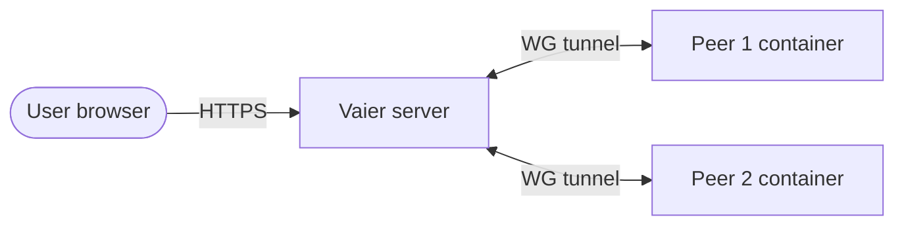

# Networking: VPN, reverse proxy, DNS, publishing

Back to [README](../README.md).

This covers how machines join the fleet, how their services reach the public internet, and the DNS and TLS mechanics underneath. If you're just getting started, the README's Quick Start is enough — come here when you're adding peers, publishing services, or want to understand what's actually happening at the edge.

---

## How it fits together



Every published service resolves to the single Vaier server through your one `*.yourdomain.com` record, terminates TLS at Traefik, optionally passes social-login authorization (Google or GitHub via oauth2-proxy, then Vaier's own access check), and is proxied over WireGuard to the container running on a peer.

---

## Adding a VPN peer

Add a peer from the **Explorer** — **Add a machine → A peer**. Vaier asks only *intent*, in plain terms, and generates everything else (tunnel address, keys, config); you never pick a raw routing type. Four small in-modal steps:

1. **What is this?** — **A server** (runs around the clock, can host services — a split-tunnel peer that can route its LAN) or **A personal device** (a phone, laptop or desktop that just needs to reach the fleet — a full-tunnel client).
2. **Which OS / device?** — a server asks **Ubuntu** or **Windows**; a personal device asks **Phone / Mac / Linux** or **Windows PC**. Windows is the only detail that changes the routing type within an intent.
3. **Name** — the one thing Vaier can't generate.
4. **Handoff** — the config, shown once, with the steps to get it onto the machine.

Your answers resolve to one of the four peer types, and each has its own handoff:

| What / OS | Peer type | Default routing | Handoff |
|-----------|-----------|-----------------|---------|
| A server / Ubuntu | Ubuntu server | VPN subnet only | **No-sudo setup link** — log in as yourself, paste one `curl -fsSL '…/vpn/peers/<id>/setup?t=<token>' \| bash` line, and it pulls the config and starts WireGuard in a container (Docker only, no root); the link is single-use and short-lived. Copying the `vaier-up.sh` script by hand stays as a fallback, plus the docker-compose download |
| A server / Windows | Windows server | VPN subnet only | `.conf` + docker-compose + brief WireGuard-for-Windows import steps |
| A personal device / Phone · Mac · Linux | Mobile client | All traffic | QR code + `.conf` |
| A personal device / Windows PC | Windows client | All traffic | `.conf` + WireGuard-app import steps |

The handoff is shown **once**, in the same modal, and each variant shows a live "waiting for first handshake — turns green on its own" indicator. A server's routed LAN isn't asked here — set it later from the machine's pane once the peer is up. When you do, you're never asked for a CIDR: Vaier reads the network the machine sits on — over the SSH connection it already has — and asks only whether the fleet should reach it, naming the machine and the interface it read it from.

**A full-tunnel client can't reach a LAN it is sitting on.** A personal device routes *all traffic* into the tunnel, and the WireGuard clients pair that with a kill-switch: untunneled traffic is blocked outright. But the operating system still prefers its own on-link route for the local subnet, so packets aimed at a machine on the network the device is physically plugged into leave *outside* the tunnel — and the kill-switch drops them. The device reaches the whole fleet and loses only the LAN under its feet. On Windows the signature is unmistakable: `tracert` to the local address reports `General failure` on the first hop, meaning the packet never left the machine, where a genuinely unreachable host would time out instead.

There is nothing to fix here, and splitting the tunnel to work around it costs more than it returns: at home you don't need the tunnel to reach your own LAN, and away from home there is no competing on-link route, so the same address works straight through the tunnel. Adding the local subnet to a client's `AllowedIPs` also collides with the on-link route at the same prefix length, which tends to hairpin local traffic out to the Vaier server and back.

Every setup script — a peer's or a LAN server's — opens with a **setup-script guard** that refuses to run on the wrong machine. A setup script reconfigures the host it runs on (Docker, network interfaces, firewall) and arrives as a one-liner you paste into a terminal, so the guard checks five things before touching anything: that the host isn't a Vaier server, that it isn't already set up as a *different* machine (each completed run records its name at `/etc/vaier/machine`), that none of the networks the script would route into the tunnel is the one the host is reachable on — which would cut it off from its own gateway — where Vaier knows the machine's address, that the host actually holds it — and, for a LAN server's relay routes, that the host isn't also running a WireGuard client. A machine is a peer *or* a LAN server, never both: the route to the VPN subnet a LAN server needs is exactly the one `wg-quick` then fails to add, and it tears the tunnel down on every boot while the container still reads as running. A refusal prints what it refused and why, changes nothing, and exits 3. If you truly mean it, re-run with `VAIER_FORCE=1`.

Each machine — VPN peer or LAN server — can carry an optional **description**, a free-text note (e.g. "Home media server (NUC, Ubuntu 22.04)") set on the Add Machine form and editable from the machine's **Edit details** dialog in the **Explorer**. It shows as a muted subtitle under the machine name so its purpose is obvious at a glance.

Peers and LAN servers can be **renamed** in place — open the machine's **Edit details** dialog in the **Explorer** and edit the **Name** field. A peer's **name** is just a display label: editing it leaves the peer's underlying id (its config directory, REST paths, and routing) untouched, so the live tunnel and any published services keep working. The id is the slug Vaier derives from the name you first typed; the name is then yours to change freely. Names **do not have to be unique**: two machines may wear the same one, because Vaier identifies every machine by an opaque **machine id** and nothing at all is keyed to the label. Call the box in each house "NAS" if that is what you call them — their credentials, backups, disk watches and shells stay entirely separate. Clearing a peer's name reverts it to the humanised id.

Every machine carries a **status colour** on its icon in the **Explorer** tree, and only where there is trouble to carry: amber (reachable but the Docker scrape failed) and red (unreachable). Reachable-and-well, and not-yet-probed, both draw nothing. (An earlier version of this file described a hover tooltip giving the state in words with its evidence. No such tooltip was ever built — see the PRD backlog, where it is now more useful than it was, since the quiet states no longer say anything for themselves.)

The fleet's machines live as entries in the **Explorer** tree; a **Map** entry at the fleet root plots each machine at its geographic location on a world map.

After creating a peer, download its config and connect. Vaier shows the peer's handshake status.

### Show-once peer config

The WireGuard config for a peer is delivered **exactly once**, at create time: the create-success modal shows the config text, an inline QR code, and download buttons for `.conf` / `docker-compose.yml` / setup script as appropriate. Save what you need before closing the modal — the five secret-bearing endpoints (`/config`, `/config-file`, `/qr-code`, `/docker-compose`, `/setup-script`) return `410 Gone` once the budget is burned.

To get a fresh config for an existing peer, the machine's pane in the **Explorer** offers two actions (folded under **Advanced**):

- **Reissue config** — re-renders the config from the *current* generation logic while **keeping the peer's keypair**, then re-opens the one-shot delivery. Use this to **recover a lost config** without disrupting the tunnel — the keys are preserved, though the re-rendered contents may differ from the original (e.g. updated `AllowedIPs`) — or to refresh one that's gone **out of date** because what Vaier would generate now no longer matches the installed config (the machine's pane shows a ⚠ **out-of-date config** badge). The live tunnel keeps working; reinstall the reissued config on the peer machine to apply it.
- **Regenerate** — deletes and recreates the peer with the same name, **rotating the keypair** as a side effect. Use this if the key may be compromised; the old config stops working immediately.

Why show-once: WireGuard has no session concept, no server-side revocation, and the same config works on any number of devices. A leaked screenshot or `.conf` would otherwise be a permanent backdoor.

### Enrolment from the Vaier app

A phone running the **Vaier app** joins without meeting the WireGuard app at all. It makes its own key on the phone and asks to join, showing a four-digit **join code** on screen while it waits — you let it in from wherever you're already signed in, your own laptop or the phone itself, and the moment you do, the phone connects on its own. You don't have to be watching the fleet page to catch it: admins get a mail with the code and the one link that lets it in. The private half of the key never leaves the phone — Vaier only ever sees the public half — so there is no config to save, no QR to photograph, and nothing to download for that phone ever again.

**Get the app from your own Vaier.** Open the launchpad on the phone and an **Install card** offers it — no store and no account. The card appears only on an Android phone, and only when your Vaier is actually carrying a copy. The copy you download has your Vaier's own address written into it, so the app already knows where it came from and never asks you to type one.

**Leaving is just as self-contained.** The phone removes itself from the fleet for good, not just from that handset. A phone you remove from the fleet notices on its own, too: it goes quiet, checks in over ordinary internet a few minutes later, and if it's no longer wanted it forgets itself, tells whoever's holding it, and offers to join again — you never have to touch the handset yourself.

*Presence from the app and key rotation are still to come.*

---

## LAN servers and the LAN scanner

**LAN servers** (a NAS, printer, IPMI host, or an extra Docker host on a peer's LAN or in the Vaier server's own subnet) are added from **Add Machine** in the **Explorer** — Vaier only needs the host's LAN address.

**Add a machine** opens with the one fork Vaier can't infer — *A peer* or *A LAN server*. Pick *A LAN server* and Vaier first asks **which LAN to scan** — a list of the networks it can reach, each said as **via <name>** with its address range (every relay site, plus the Vaier server's own LAN). Pick one and Vaier scans **just that LAN**, so the page stays small and the sweep is quick; the hosts it already found there show **instantly** (the last scan is cached, and a fresh one arrives live — no waiting, no polling). Pick a host and **adopt** it in a single call: the only thing you type is the name, over a read-only *Detected by Vaier* readout of everything the scan already knows — kind, LAN address, the site it's reached via, any open Docker port, its cross-site route. **When the host actually speaks SSH**, you can attach an SSH credential as you adopt and **test** it first — Vaier opens a throwaway connection to prove the login works (and never stores one it couldn't verify), all without echoing the secret; a host that doesn't answer on SSH is adopted without one. Already-registered machines are filtered out, so only new hosts appear.

On an empty scan (or a LAN Vaier can't reach) an **Add by address instead** fallback still registers a LAN server by hand — and it's the same experience, only you type the address instead of picking it: Vaier **probes the address you type** (a targeted, single-host check — it only inspects the one host you named) and prefills the same *Detected by Vaier* readout, including a **Test connection** SSH credential you can attach as you add whenever the host answers on SSH. Detection never blocks the add — a host that doesn't answer is still added by hand.

Whether you pick a scanned host or type its address by hand, Vaier **probes the host** and prefills what it detects (Docker port, device category), and lets you attach and **test** an SSH credential right there when the host answers on SSH — so the by-hand path is the same experience as adopting a scanned one. After adopting, the Explorer hands you a copyable **setup link** — a `curl -fsSL '…/lan-servers/<name>/setup?t=<token>' | sudo bash` one-liner, shown in the adopt dialog and on the machine's **Setup script** control — that the host runs to pull and run its setup script over HTTPS (needs `sudo`, since it installs Docker). Like the peer setup link it's single-use and short-lived; a bare host has no sign-in session, so a single-use **setup token** stands in for one (the by-hand `setup.sh` download stays as a fallback). The script adapts to what the host needs: it opens the Docker engine API (if you marked it as running Docker — native and snap installs covered), **locks that API to the fleet** (it's unauthenticated, so the script firewalls it to only the relay gateway your Vaier traffic actually arrives from and drops it from everyone else, installed as a systemd service so it survives reboots), and installs persistent routes to the Vaier server's subnet (and other sites' LANs) via the host's relay peer, so a machine behind one relay can reach the rest of your Vaier network. It's idempotent and safe to re-run — a host with nothing to set up is simply left as-is.

For registering LAN servers from non-peer machines and the V1 routing limitations that come with it, see [`docs/ADVANCED.md`](ADVANCED.md).

---

## Publishing a service

1. Start a Docker container on any connected peer.
2. In Vaier's **Explorer**, open the peer's pane; the container appears as a **+ Publish** row among its services.
3. Click it, enter a subdomain, optionally require Social login (Google sign-in).
4. Vaier writes the Traefik route and (optionally) the social-login middleware chain. No DNS step — the name already resolves under your wildcard record.

The service is live at `https://subdomain.yourdomain.com`.

A machine's **published services** are child entries under it in the **Explorer** tree: open one to edit its authentication, display name, allowed groups, and advanced options, or to **Unpublish** it. The machine's discovered-but-unpublished containers appear as **+ Publish** rows that open the publish flow pre-filled, each with an **Ignore** button to hide it (a machine with ignored candidates shows a collapsible "N hidden" line to reveal and **Unignore** them); a relay-anchored LAN server adds a **Publish LAN port** form for publishing a bare host:port (port + protocol + subdomain). Every publish runs as a non-blocking **progress card** for the one step there is — reverse-proxy routing — turning green on success or red on rollback, and rebuilt from the server on reload so a refresh never loses an in-flight publish. Unpublishing asks for confirmation and tears down the Traefik route while leaving the container running; DNS is untouched, since the name resolves under your wildcard record either way.

On the **Vaier server** itself, the containers of Vaier's own stack are not offered as candidates — the console, Traefik, WireGuard, oauth2-proxy, Dex, CrowdSec, the Docker socket proxy, the offline page and their sidecars are Vaier's plumbing, and the socket proxy in particular serves the Docker API, which is not something to put behind a public hostname. Your own containers on that host are discovered exactly as they are anywhere else. The one deliberate exception is **Traefik's dashboard** on port 8080, which appears as a candidate with a `/dashboard/` redirect already filled in: publish it if you want it, on the hostname you choose and — the sane choice — behind social login.

For per-service auth mode and access rules (who can reach a Social-login service), see [`docs/AUTH.md`](AUTH.md).

### Multiple services on one subdomain

Set an optional **Path prefix** at publish time (e.g. `/auth`) to put more than one service behind a single subdomain. Traefik routes by `Host(...) && PathPrefix(...)`, picks the more-specific rule first, and forwards the full path unchanged to the backend:

```
bmp.yourdomain.com         →  http://rig.yourdomain.com:8080
bmp.yourdomain.com/auth/*  →  http://rig.yourdomain.com:8090/auth/*
```

(`/auth` reaches the backend intact — Vaier doesn't strip the prefix.)

Siblings on one host are independent: each is published and unpublished on its own, and removing one never affects another. There is no shared DNS record to keep track of — the host name resolves under your wildcard record whether one route sits on it or five.

For publishing services from non-peer LAN machines (NAS, printers, extra Docker hosts), see [`docs/ADVANCED.md`](ADVANCED.md).

### Publishing a port that is not a website

When you publish, you say whether the port serves a **website** or **raw TCP**. Either way the port you enter is the *backend* port — the port Traefik connects to on the machine — and never the port clients connect on: every published route is bound to the `websecure` entrypoint, so visitors always arrive on 443.

A raw-TCP port is published as a **stream**. Vaier writes a Traefik TCP router matched by `HostSNI(...)` on that same 443 entrypoint, with the same Let's Encrypt resolver — Traefik issues the hostname's certificate through the HTTP-01 challenge on port 80 exactly as it does for an HTTP router. It terminates TLS, then forwards the decrypted bytes to the backend port unchanged. Clients connect to `mqtt.example.com:443` over TLS and speak MQTT, or Postgres, or whatever the service speaks. Many streams share the one entrypoint, because `HostSNI` reads the name out of the TLS handshake — so a stream is the same hot file write every other publish is: no compose edit, no new host port, no Traefik restart, no firewall rule.

**A stream cannot be put behind a login, and CrowdSec does not watch it.** Nothing inside a TCP stream is an HTTP request, so there is no request for oauth2-proxy to redirect to Google and none for the CrowdSec bouncer to inspect — both are Traefik HTTP middlewares, and a TCP router takes no middlewares at all. Vaier refuses social login on a stream rather than showing a padlock over an open door. The service's own credentials are the only gate, so publish a stream only for a service whose own authentication you trust, and give it a real password.

A stream also has no URL: it takes no path prefix (`HostSNI` matches the host and nothing else), no root redirect, and it never gets a launchpad tile. Its pane shows the address to dial instead.

If the client cannot speak TLS, the VPN is still the answer. Reach the service over the tunnel at the machine's LAN address and its real port: a LAN server behind a relay peer is reachable from every connected peer, so `192.168.x.y:6690` works from anywhere on the fleet — no port exposed to the internet, and the transport is already encrypted by WireGuard, so the service's own TLS can usually be turned off.

---

## Smart launchpad

A public, **viewer-adaptive** dashboard that links to your published services, switching to direct LAN URLs when you're on the same network. A logged-out visitor sees only your public services; sign in and it additionally shows every social-login service that identity is allowed to reach (admins see all) — so internal URLs never leak to strangers, while admin pages stay admin-only.

Tiles show the path segment (for path-based routes) or the subdomain, with an optional operator-supplied display name. Hover a tile to see the Docker image and version behind the service — or point a service at a version endpoint so one running natively on a LAN machine reports its version too. Hide internal-only services per route, and read each tile's status dot at a glance — green when the hosting machine is confirmed reachable, grey while reachability is still being probed (e.g. just after startup), and a red "host offline" dot when the machine is confirmed unreachable (VPN handshake age or LAN reachability probe). Vaier's own infrastructure hosts (the console, oauth2-proxy, and the Dex broker) are never listed as tiles.

---

## Reverse proxy

Traefik dynamic config generated automatically, with a per-service **auth mode** (public or **Social login** — Google or GitHub via oauth2-proxy, with Vaier deciding who's approved) and root-path redirect. When a service's backend is down, visitors get Vaier's branded **offline page** (naming the service, with retry and back-to-launchpad links) instead of Traefik's bare gateway error. A standalone page server stands in even when **Vaier itself** is down, so the control panel host shows the branded page rather than "Bad gateway".

## Edge hardening

Traefik enforces a baseline on every response it serves, whatever the backend does or forgets to do. Two **security headers** — `X-Content-Type-Options: nosniff` and `Referrer-Policy: strict-origin-when-cross-origin` — ride the HTTPS entry point itself, so they reach Vaier's own pages and every **published service** alike, including ones published long before this existed. A **frame guard** (`X-Frame-Options: SAMEORIGIN`) is deliberately *not* fleet-wide — it goes on Vaier's own surfaces only, because a published app may legitimately embed or be embedded and Vaier would break it silently and at scale. `Content-Security-Policy` is left to the application: Vaier's own file viewer already serves each previewed file under a tight per-type policy, and a policy imposed at the edge would either overwrite that or intersect with it. The **edge TLS policy** puts a floor under the handshake — TLS 1.2 minimum, forward-secret AEAD cipher suites only, so no CBC, RC4, 3DES or static-RSA key exchange — for every route without touching a single route definition. Certificate issuance is untouched: the Let's Encrypt HTTP-01 challenge is served over plain HTTP.

A CrowdSec Security Engine and bouncer sit ahead of everything else on the entry point, blocking traffic already recognised as malicious (probing for `.env` files, WordPress admin paths, known CVEs, and more) before it reaches oauth2-proxy or any backend. Your own VPN and LAN traffic — the **trusted networks** — is never subject to a block decision.

Every address currently blocked is listed in the Explorer's **Security** view: the source address, where CrowdSec places it (country and network operator), the scenario that caught it, and how long the block lasts — live, and drawn on the fleet's **Map** as well when the address can be placed. Each row carries the two things you can do about it: **Lift the block** lets that address back in now (one-off — the next scenario it trips blocks it again), and **Trust this address** says never block it again, folding it into your **trusted networks** as a single host.

The Security view also lists what you have already trusted, with an **Untrust** verb on each — trusting stands until you take it back, and taking it back blocks nobody. Only the addresses you trusted by hand appear there: the structural parts of your **trusted networks** (your VPN, the container network, the networks behind your machines) are what stop CrowdSec turning away your own traffic, so they are named as covered and never offered for removal.

The other direction is on the **Map** too: every place someone has been *let in* from, one green dot per city, with the count and the people allowed from there, kept for a month. Accesses from your own LAN or VPN have no place on a map and are shown as a plain count beside it rather than quietly dropped — and so is a request from a full-tunnel device, which comes back to Vaier wearing the server's own address and would otherwise draw a dot wherever the server happens to be hosted.

One honest caveat, and it cuts both ways: CrowdSec re-reads its allowlist only when it restarts. So trusting an address lifts its block immediately, but the allowlist entry itself takes effect at CrowdSec's next restart — and an untrust likewise doesn't reach CrowdSec until then. Vaier deliberately won't restart the engine for you — bouncing the thing guarding the door is how an operator ends up locked out. And if one ever does lock you out, `docker exec crowdsec cscli decisions delete --all` clears every active block from the host's shell.

---

## Wildcard DNS

DNS is one record you make once, at whatever DNS host your domain lives on: `*.yourdomain.com  A  <your server's public IP>`. Vaier never touches DNS after that — publishing a service writes a Traefik route and nothing else, so a service is live as soon as the route is up. At boot Vaier **checks** the record for you (it looks up a random name under your domain on a public resolver and compares the answer with this server's own public IP) and says in plain words whether it's covered, not resolving, pointing somewhere else, or unconfirmed — in the boot log and in **Settings**.

That one record answers for everything: the console at `vaier.yourdomain.com`, the sign-in hosts `oauth2.yourdomain.com` (where oauth2-proxy serves the sign-in flow) and `dex.yourdomain.com` (the Dex identity broker behind it that federates Google and GitHub), and every service you publish from now on. There is nothing to add when you publish a service, and no DNS credentials to give Vaier — any provider that can serve a wildcard `A` record works.

> **One caveat worth knowing.** Vaier publishes machine-qualified names two labels deep — `openhab.colina27.yourdomain.com`. A DNS wildcard only covers a name while nothing more specific claims a label above it, so the moment your zone gains a real record *under a machine label* (say an `A` record for `colina27.yourdomain.com`), `*.yourdomain.com` stops covering everything beneath `colina27` and that machine's services go dark. Keep the zone free of records under a machine label, or add a `*.colina27.yourdomain.com` wildcard alongside it.

Vaier checks this for you at every boot: it looks up a random two-label name under your domain on a public resolver (`1.1.1.1`, `8.8.8.8`) and compares the answer with this server's own public IP, then states the verdict — **covered**, **not resolving**, **resolves elsewhere**, or **unconfirmed** — in the boot log and in **Settings**.

Traefik holds its first Let's Encrypt request until the three infrastructure hostnames it needs (`vaier`, `oauth2`, `dex`) actually resolve on a public resolver. **A wildcard record satisfies that wait immediately** — the names resolve the moment the record exists, which is before you ever run `docker compose up`. The wait stays in place as a safety net: it is what makes the stack come up with real certificates on the first try instead of asking Let's Encrypt before the names resolve, tripping its "5 failed authorizations per hostname per hour" limit and stranding the site on Traefik's self-signed default cert for an hour. It fails open after a few minutes, so a missing wildcard record never leaves the box without a reverse proxy forever.

Certificates themselves are unchanged: Let's Encrypt still issues one per hostname over the HTTP-01 challenge. The wildcard record only makes a name *resolve* — it is not a wildcard certificate.
